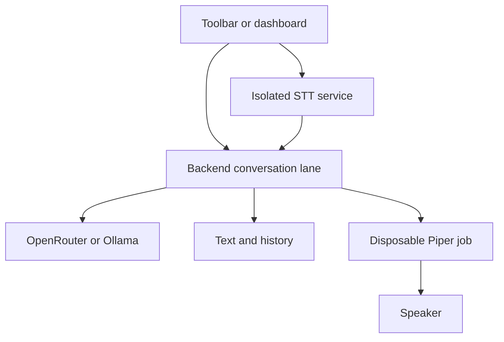

# Voice runtime and interaction modes

OpenMimicry v1.5 treats audio as an optional, crash-contained side effect of a
text conversation. Microphone capture, model inference, synthesis, and playback
cannot own or block the FastAPI event loop.

## Runtime topology



The STT service is a supervised child process. It preloads Faster-Whisper once,
owns the PortAudio handle, records finite utterances, and sends final transcripts
over newline-delimited JSON. If it exits or misses a command deadline, the
adapter terminates it and prepares a new worker without restarting the backend.

Each TTS reply uses a fresh process. The process synthesizes a complete WAV,
validates it, reports `playback_started`, and plays it. Interruption terminates
the process. No COM object, playback thread, engine instance, or audio handle is
reused by the following reply.

The legacy `realtimestt` and `realtimetts` adapters remain installable through
`openmimicry-voice[legacy-realtime]`, but they are not part of the supported
Windows profile.

## Configuration

```yaml
voice:
  stt:
    adapter: isolated-faster-whisper
    language: en
    model: medium.en
    device: auto
    compute_type: auto
    beam_size: 5
    speech_threshold: 0.015
    sample_rate: 16000
    post_speech_silence_duration: 1.0
    wake:
      names: [Mimi, Hey Mimi]
      aliases: [Me me]
  tts:
    adapter: isolated-piper
    engine: piper
    voice: en_US-lessac-medium
    data_dir: ~/.openmimicry/voices
    rate: 1.0
    interruptible: true
  modes:
    text_always_on: true
    push_to_talk_hotkey: Ctrl+Space
    continuous_listening: false
    live_wake: false
    agent_voice: true
    barge_in_enabled: false
```

Recognition presets exposed by the dashboard are:

| Model | Intended hardware | Trade-off |
|---|---|---|
| `medium.en` | CPU, INT8 | Supported default; stronger English recognition |
| `distil-large-v3` | NVIDIA GPU, FP16 | Strong English recognition with lower latency than large-v3 |
| `large-v3` | High-memory GPU or patient CPU use | Maximum multilingual accuracy |
| `small.en` | Lower-memory CPU | Faster, less reliable for names |
| `base.en` / `tiny.en` | Constrained systems | Lowest latency and accuracy |

`device: auto` tries CUDA when CTranslate2 detects it, then proves the runtime
by loading the model and running inference. Missing CUDA DLLs or another failed
GPU initialization automatically fall back to CPU/INT8. `device: cuda` remains
strict for users who explicitly require GPU execution.

## Input modes

### Text

Text is always independent of voice. An accepted user message appears at once.
The LLM reply appears when generation completes, before TTS is queued. A missing
microphone, failed synthesis, or terminated playback cannot suppress either.

### Push-to-talk

Hold the toolbar microphone or `Ctrl+Space`. Pressing starts a fresh finite
recording; releasing closes the recording and submits one transcription job to
the already-loaded model. Push-to-talk does not require the wake name.

The UI sequence is `listening → transcribing → thinking`. Empty audio produces
an explicit no-speech result and always leaves `transcribing`.

### Wake listening

Wake listening continuously segments speech with energy VAD. Every utterance is
transcribed immediately after the configured silence interval. The raw text is
shown in conversation history, but only a transcript beginning with a configured
name or alias is submitted to the LLM. The prefix is removed before submission.

For example, `Mimi, tell me a joke` submits `tell me a joke`; `tell me a joke`
is recorded as heard but not submitted.

### Continuous listening

Continuous mode uses the same segmentation but submits every nonempty final
transcript. It is intended for controlled or headset environments. Wake mode is
the safer hands-free default.

### Endpointing

`post_speech_silence_duration` controls the silence required to finalize a live
utterance. The allowed range is 0.2–3.0 seconds. Increase it if pauses between
clauses cause early submission. It does not change the push-to-talk boundary:
release remains authoritative there.

## Output and visual state

The priority order is:

`listening → transcribing → thinking → speaking → idle`

Speaking begins only when the child reports `playback_started`, never when text
is queued or WAV synthesis begins. A PTT press cancels the playback process
before publishing `UserSpeechStarted`. A late event from the terminated process
cannot overwrite listening because the controller publishes TTS state only for
its current task.

With laptop speakers, passive listening pauses during TTS to avoid transcribing
the avatar itself and resumes after the playback process exits. Explicit PTT
still interrupts immediately. `barge_in_enabled` should be enabled only with
headphones or reliable echo cancellation.

## Failure behavior

| Failure | Required behavior |
|---|---|
| Piper model missing | Text works; TTS readiness is false; diagnostics identify the model path |
| TTS job hangs | Process is terminated; the next reply starts a fresh process |
| STT worker exits | Current voice turn fails clearly; the next voice action recreates the worker |
| No microphone | Backend and typed chat start normally; voice status is unavailable |
| OpenRouter error | An LLM error is recorded independently of voice state |
| WebSocket reconnect | Completed text/history replays; no audio job is replayed |

Voice failures are logged under `~/.openmimicry/logs` and exposed in the
diagnostic bundle. They are not rendered as a blocking conversation overlay.

## Preflight and acceptance

`scripts/voice_doctor.py` verifies the real dependency and device boundary. It:

1. enumerates at least one microphone and speaker;
2. runs multiple independent Piper synthesis jobs;
3. validates every generated WAV;
4. optionally plays the final sample;
5. loads the selected Faster-Whisper model and transcribes a generated sample.

On Windows, `start-openrouter-voice.ps1` runs this preflight once per v1.5
installation and stores a versioned pass marker. Set
`OPENMIMICRY_VOICE_PREFLIGHT=force` to run it again after changing devices or
drivers.

CI uses subprocess fakes to verify repeat turns and forced-hang recovery without
audio hardware. Release acceptance additionally requires the real Windows matrix
in `docs/V1.5.1_WINDOWS_TESTING.md`.
